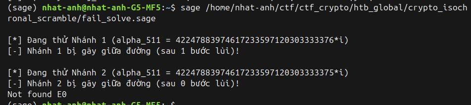
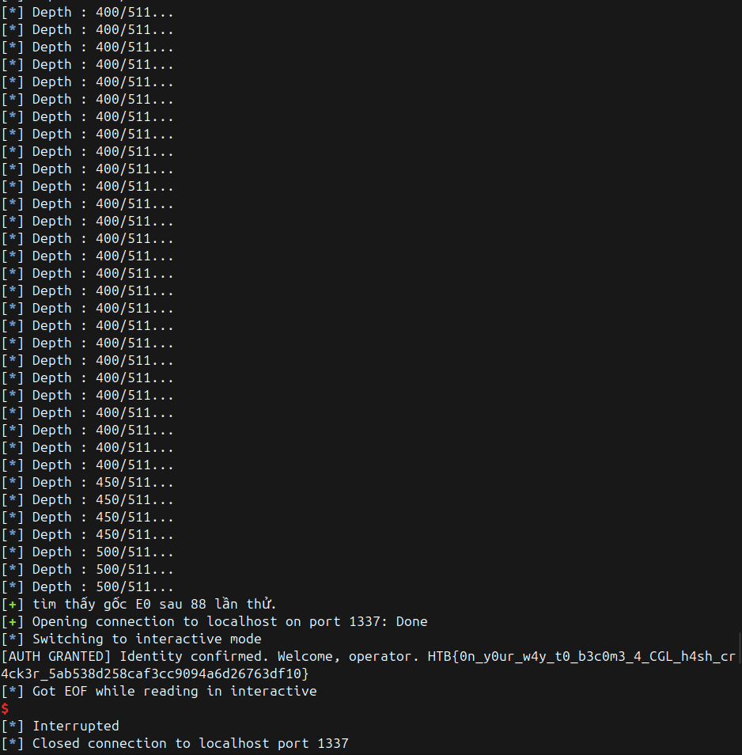
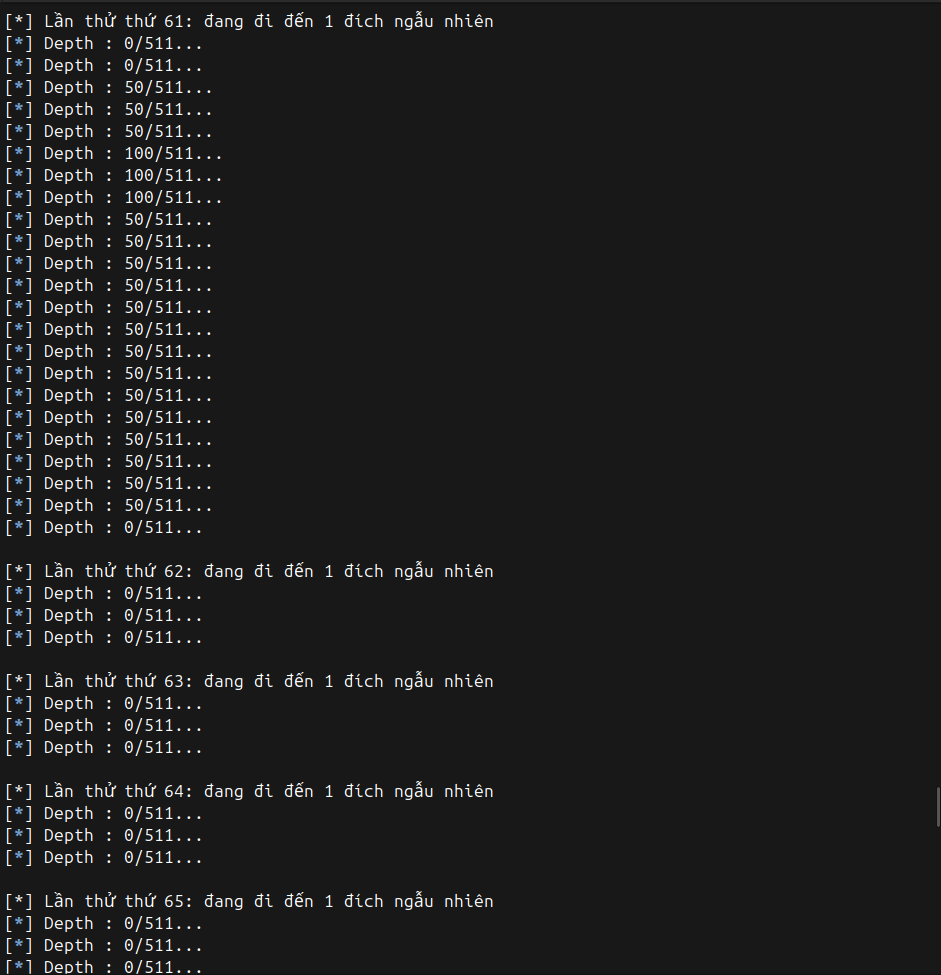

# Isochronal scramble

## Catefory: Crypto 

## 1, Tổng quan về challenge 
### Hàm băm CGL 
- Server code mô phỏng cấu trúc hàm băm GCL dựa trên đồ thị đẳng cấu bậc 2 (**2-isogeny graph**) trên tập các đường cong siêu đặc dị (**Supersingular Elliptic Curves**).

```sage
p = 2**49 * 3**36 - 1
K = GF(p**2, "x", modulus=[1, 0, 1])
x = K.gen()


def deterministic_sqrt(x):
    return min(x.sqrt(all=True))


def select0(E0, b0):
    torsion_points = sorted(E0.torsion_polynomial(2).roots(multiplicities=False))
    if b0:
        return torsion_points[-1], torsion_points[1]
    else:
        return torsion_points[1], torsion_points[-1]


def select(lambda0, lambda1, b):
    if b:
        return max(lambda0, lambda1)
    else:
        return min(lambda0, lambda1)


def next_curve(A, alpha, b):
    xi = alpha**2
    zeta = 3 * xi + A
    eta = deterministic_sqrt(zeta)
    new_A = -(4 * A + 15 * xi)

    lambda0 = alpha + 2 * eta
    lambda1 = alpha - 2 * eta
    new_alpha = select(lambda0, lambda1, b)
    return new_A, new_alpha


def data_to_bits(data):
    bits = [int(b) for c in data.encode() for b in "{:08b}".format(c)]
    assert bits and all(b in (0, 1) for b in bits)
    return bits


def CGL_hash(E0, data):
    data = data_to_bits(data)
    n = len(data)

    A = E0.a4()
    alpha, _ = select0(E0, data[0])
    for i in range(n - 1):
        A, alpha = next_curve(A, alpha, data[i + 1])

    xi = alpha**2
    new_A = -(4 * A + 15 * xi)
    new_B = -alpha * (8 * A + 22 * xi)

    E = EllipticCurve(E0.base_field(), [new_A, new_B])
    j = str(E.j_invariant()).encode()
    return sha256(j).hexdigest()
```
- Hàm băm dựa vào các bit của dữ liệu được băm để  xác định đường đi trên đồ thị đẳng cấu để đi đến kết quả (curve đích) 
    - dùng bit để xác định điểm xoắn bậc 2 ( có dạng $(\alpha,0)$) nào được chọn để làm kernel đi đến đường cong siêu dị tiếp theo, và bước đến đường cong tiếp theo bằng hệ **hệ thức Velu** 
- Cấu trúc hàm băm
    - Xác định 1 curve khởi đầu của đường đi là $E_0 (A_0, B_0)$
    - Với bit đầu tiên ,sử dụng đa thức xoắn 2 (torsion_polynomial(2) : $x^2 + A_0x + B_0 =0$) trên $E_0$ để tìm các hạt nhân bậc 2. Hàm **select0** dựa vào bit đầu tiên data[0] để chọn ra một điểm hạt nhân $\alpha_0$ (để đi đến curve $A_1$) một cách cố định theo quy ước.
    - Với các bit sau ( $1 -> l-1$): hàm **next_curve** sẽ lấy vào $A_{n-1}$, $\alpha_{n-1}$ và bit thứ $n$ (kết hợp với hàm **select**) để tính ra $A_{n}$ và $\alpha_{n}$ . Sử dụng hệ thức **Velu** cho đẳng cấu bậc 2 (2-isogencyisogency)
        - $\eta = min(\sqrt{3 \alpha^2 + A_{n-1}})$
        - $\lambda_0 = \alpha_{n-1} + 2 \eta$
        - $\lambda_1 = \alpha_{n-1} - 2 \eta$
        - $A_n = -(4 A_{n-1} + 15 \alpha_{n-1}^2)$
        - $\alpha_n = select(\lambda_0, \lambda_1, bits[n])$
    - Tính curve cuối cùng :
        - $A_l = -(4 A_l + 15 \alpha_l^2)$
        - $B_l = - \alpha_l (8 A_l + 22 \alpha_l^2)$
    - bước cuối:
        - lấy j_invariant của hàm băm cuối : $j = 1728 \cdot \frac{4 A_l^3}{4 A_l^3 +27B_l^2}$
        - Băm j_variant bằng SHA256 để trả về kết quả hàm băm CGL

### Nhiệm vụ của challenge 
- Ta cần tìm 1 curve khởi tạo $E_0$ và data credential thỏa mãn khi băm credential với curve khởi tạo là $E_0$ thì ta thu được chính credential ( băm như ko băm)


## 2, Chiến lược tấn công 

### 2.1 Ý tưởng đầu tiên 
- $j variant$ được đi qua SHA256 trước khi trả về output => ta ko thể điều khiển được đầu ra từ đầu vào của hàm băm , vậy nên ta sẽ :
    - Lấy giá trị $jvariant$ của 1 đường cong siêu dị , sau đó lấy $SHA256(jvariant)$ để làm đầu vào của hàm băm CGL
        - Với $p \equiv 3 (mod4)$ => ta chọn đường cong phổ biến là $y^2 = x^3 + x$
        - data đầu vào của hàm băm GCL chính là chuỗi hex kết quả của SHA256 => có 512 bit
    - => Ta phải tìm đường cong khởi tạo $E_0$ sao cho đường đi từ $E_0$ qua đường đi xác định bởi các bit trên chuỗi data sẽ đi đến đường cong đích là $y^2 = x^3 + x$
        - Bài toán trở thành tìm đường đi lùi từ $E_{512} : y^2 = x^3 + x$ để tìm về đường cong $E_0$ 

### 2.2 Có thể đi ngược từ $E_{512}$ về $E_0$ không? 
- Ta đã có đường đi , vậy liệu với $E_{512}$ thì có xuất hiện 1 đường đi lùi dựa trên data để tìm về $E_0$ được ko 
### 2.2.1 Điểm cuối trên đường cong  $E_{512}$ về $E_{511}$ 
- Để tìm $A_{511}$ và $\alpha_{511}$ từ đường cong $E_{512}$ ta lập hệ:
  
$$
\begin{cases}
A_{512} = - 4 A_{511} - 15 \alpha_{511}^2 \\
B_{512} = - \alpha_{511}(8 A_{511} + 22 \alpha_{511}^2)
\end{cases}
$$

$$
=> 8 \alpha_{512}^3 - 2 A_{512} \alpha_{511} - B_{512} = 0
$$

- => Ta được 2 nghiệm $\alpha_{511}$ ( trừ $\alpha_{511}$= 0) , từ đó có 2 đường cong $E_{511}$ khi đi từ $E_{512}$ về 1 bước 
- => Ta có thể thử bước lùi tiếp từ 2 đường cong $E_{511}$ này này (thử cả 2 nhánh ) 

### 2.2.2 Bước cuối tìm $E_0$ 
- Giả sử ta có thể nối chuỗi đi ngược về đến tận điểm $E_0$ và ta tìm được $A_0$ và $\alpha_0$
* Ta sẽ khôi phục $B_0$ như sau , từ phương trinh:
  
$$
\alpha_0 ^2 + A_0 \alpha_0+ B_0 =0
$$

$$
=> B_0 = - \alpha_0^2 - A_0 \alpha_0  
$$

- Nhưng ta ko chắc rằng $\alpha_0$ có thỏa mãn hàm **select0** hay ko => ta cần phải check

- => rất có thể đường đi sẽ đứt khi đi được đến cuối 

### 2.2.3 vấn đề thực sự nằm ở các node trung gian trên đường đi 
**Ý tưởng về tìm đường đi lùi từ một đường cong** 

- Với phương trình tìm next curve mà challenge cho , ta có thể xây dựng phương trình để tính prev curve như sau :
  
$$
\begin{cases}
\alpha_{n} = \alpha_{n-1} \pm2 \cdot \min(\sqrt{3 \alpha^2 + A_{n-1}})\\
A_n = -(4 A_{n-1} + 15 \alpha_{n-1}^2)
\end{cases}
$$

$$
=>
\begin{cases}
A_{n-1} = - \frac{(A_n + 15 \alpha_n^2)}{4}\\
\alpha_n - \alpha_{n-1} = 2 \cdot \min(\sqrt{3 \alpha^2 - \frac{(A_n + 15 \alpha_n^2)}{4}})
\end{cases}
$$

$$
=> (\alpha_n - \alpha_{n-1})^2 = 12 \alpha_{n-1}^2 - A_{n} - 15 \alpha_{n-1}^2
$$

$$
=> 4 \alpha_{n-1}^2 - 2 \alpha_n \alpha_{n-1} + (A_n + \alpha_n^2) = 0 
$$

- giải phương trình bậc 2 ta sẽ thu được 2 nghiệm ẩn $\alpha_{n-1}$ là $\alpha_1$ và $\alpha_2$ 
- Từ mỗi giá trị ta có được 1 giá trị hệ số A tương ứng là $A_1$ và $A_2$ 


=> **Vậy liệu 2 nghiệm này có thỏa mãn chính là đường cong trước khi đi lùi $E_n$ lại ?**


- Ta thấy rằng ở trong code server , có 2 ràng buộc tác động đến việc chọn điểm xoắn bậc 2 để đi tới đường cong tiếp theo 
    ```sage
    def deterministic_sqrt(x):
    return min(x.sqrt(all=True))
    ```
    ```sage
    def select(lambda0, lambda1, b):
    if b:
        return max(lambda0, lambda1)
    else:
        return min(lambda0, lambda1)
    ```
=> Một nghiệm khi check bằng cách đi xuôi lại hàm next_curve có thể đúng hoặc ko (đi xuối theo công thức có đến $E_n$ ko)
thể
#### Đánh giá về số đường đi lùi có thể của các đường cong trung gian 
- Với 2 nghiệm $\alpha_1$ và $\alpha_2$ và 2 giá trị $A_1$ và $A_2$ ta giải được , ta thay lại vào phương trình , ta được các biểu thức :
  
$$
\begin{cases}
(\alpha_{n} - \alpha_{1})^2 = 4(3\alpha_{1}^2 - A_{1}) \\
(\alpha_{n} - \alpha_{2})^2 = 4(3\alpha_{2}^2 - A_{2})
\end{cases}
$$

$$
=> 
\begin{cases}
\alpha_{n} - \alpha_{1} = 2\sqrt{3\alpha_{1}^2 - A_{1}} \quad (1) \\
\alpha_{n} - \alpha_{1} = -2\sqrt{3\alpha_{1}^2 - A_{1}} \quad (2) \\
\alpha_{n} - \alpha_{2} = 2\sqrt{3\alpha_{2}^2 - A_{2}} \quad (3) \\
\alpha_{n} - \alpha_{2} = -2\sqrt{3\alpha_{2}^2 - A_{2}} \quad (4)
\end{cases}
$$

- Từ hệ 4 biểu thức ở trên, ta chia thành 2 tập hợp :
    * **Tập 1 (Nhánh $\alpha_{1}$):** Gồm biểu thức $(1)$ và $(2)$.
    * **Tập 2 (Nhánh $\alpha_{2}$):** Gồm biểu thức $(3)$ và $(4)$.

- Hàm **deterministci_sqrt** sẽ chọn ra mỗi nhánh 1 biểu thức bằng việc so sánh 
    - $\sqrt{3\alpha_{1}^2 - A_{1}}$ và $- \sqrt{3\alpha_{1}^2 - A_{1}}$ ở nhánh 1 
    - $\sqrt{3\alpha_{2}^2 - A_{2}}$ và $- \sqrt{3\alpha_{2}^2 - A_{2}}$ ở nhánh 2
- Hàm **select** sẽ chọn ra mỗi nhánh 1 biểu thức bằng việc xác định bit và so sánh theo quy tắc 
    - $\alpha_1 + 2\sqrt{3\alpha_{1}^2 - A_{1}}$ và $\alpha_1- 2\sqrt{3\alpha_{1}^2 - A_{1}}$ ở nhánh 1 
    - $\alpha_1 + 2\sqrt{3\alpha_{2}^2 - A_{2}}$ và $\alpha_1 - 2\sqrt{3\alpha_{2}^2 - A_{2}}$ ở nhánh 2

- Nghiệm nào trải qua được cả 2 bộ lọc sẽ tạo thành 1 prev curve hợp lệ của $E_n$ 
- Vì các giá trị này còn phụ thuộc và $\alpha_n$ và $A_n$ => ta rất khó để định hướng được quy luật của việc so sánh 
- Nhưng nếu coi như xác suất 1 nghiệm vượt qua được mỗi bộ lọc là 50/50 , ta rút ra dc kết luận sau
    - Xác suất để cả 2 nghiệm đều hợp lệ là $0,25$ ( ta có thể đâm 2 nhánh )
    - Xác suất để cả 1 nghiệm đều hợp lệ là $0,5$ ( ta có thể đâm nhánh tiếp)
    - Xác suất để cả 0 nghiệm đều hợp lệ là $0,25$ ( nhánh cụt)


=> **Ta kết luận rằng không phải lúc nào nhánh cũng đâm về tận cuối được**

### 2.3 Chiến lược backtrack để tìm đến $E_0$ 
**Với các xác suất đi lùi được của 1 đường cong như đã nói ở trên , liệu ta có thể đi lùi tận 512 lần?**
- => Tùy thuộc vào độ may mắn 

**Đánh giá với chiến lược backtracking**
- Với backtracking , ta sẽ cố đâm mọi nhánh đi lùi có thể đến khi đi được 512 bước để đến $E_0$ 
- Giả sử từ điểm xuất phát , ta đâm được 2 nhánh , và tại mỗi nhánh sau đó ,mỗi điểm có thể đâm được 0 , 1 hoặc 2 nhánh tiếp  
    - Nếu ta xuất phát với 1 đường cong đích không may mắn , hoàn toàn có thể nhánh nào cũng sẽ cụt 
    - Nếu ta xuất phát với 1 đường cong đích may mắn hơn , tức cây tìm kiếm có thể đâm sâu hơn so với đích không may mắn
        - nếu cây tìm kiếm có thể đâm sâu thêm => vì đâm càng xấu , với xác suất đâm 2 là 0,25 , đâm tiếp là 0,5 thì càng sâu càng có nhiều nhánh , mà càng có nhiều nhánh thì xác suất có nhiều nhánh đâm dc sâu nữa lại càng cao => cây sẽ khó mà bị cụt hết đường hơn , tức là càng đâm được sâu càng khó chết 
        - Ta hoàn toàn có thể đâm đến 512 tầng đối với trường hợp này 

=>  Ta có thể thử backtracking từ 1 đường cong đích, nếu may mắn ,ta có thể đâm tận 512 lần và lấy được $E_0$ 

**Thử với đường cong $y^2 = x^3 + x$**
- Thử xuất phát đi lùi với đường cong đích , ta nhận ra đây là 1 đường cong không may mắn



### 2.4 Trick cuối cùng : Bước tiến vài bước để lùi 
- Đường cong $y^2 = x^3 + x$ không thể đi về đích , vậy ta có thể tìm cách để đi đến các đương còng khác để lấy làm điểm đich để xuất phát lùi về 
- Code server đã cho ta sẵn cách để đến các đường cong siêu đặc dị khác từ 1 đường cong xuất phát 
- Ta sẽ bước ngẫu nhiên theo chiều xuôi một vài bước từ đường cong $y^2 = x^3 + x$ đến với các đường cong khác để thử backtrack về , nếu cây tìm kiếm bị cụt giữa đường , ta lại bước ngẫu nhiên đến một đường cong khác để thử lại , cho đến khi gặp được một đường cong may mắn có thể quay trở về $E_0$ 
- Việc thử nhiều lần gần như sẽ có một đường cong đi được đến đích $E_0$ 


## 3, Code khai thác 

```sage
from sage.all import *
from pwn import *
import hashlib
import random

p = 2**49 * 3**36 - 1
K = GF(p**2, "x", modulus=[1, 0, 1])
x = K.gen()

P_y = K['y']
y = P_y.gen()#old_alpha variable 

def deterministic_sqrt(val):
    return min(val.sqrt(all=True))

def select0(E0, b0):
    torsion_points = sorted(E0.torsion_polynomial(2).roots(multiplicities=False))
    if b0:
        return torsion_points[-1], torsion_points[1]
    else:
        return torsion_points[1], torsion_points[-1]

def select(lambda0, lambda1, b):
    if b:
        return max(lambda0, lambda1)
    else:
        return min(lambda0, lambda1)

def next_curve(A, alpha, b):
    xi = alpha**2
    zeta = 3 * xi + A
    eta = deterministic_sqrt(zeta)
    new_A = -(4 * A + 15 * xi)
    lambda0 = alpha + 2 * eta
    lambda1 = alpha - 2 * eta
    new_alpha = select(lambda0, lambda1, b)
    return new_A, new_alpha

def data_to_bits(data):
    bits = [int(b) for c in data.encode() for b in "{:08b}".format(c)]
    assert bits and all(b in (0, 1) for b in bits)
    return bits


def backtrack(A_curr, alpha_curr, bit_idx, bits):
    if bit_idx == 0:
        B0 = -alpha_curr**3 - A_curr * alpha_curr
        E0 = EllipticCurve(K, [A_curr, B0])
        
        alpha_test, _ = select0(E0, bits[0])
        if alpha_test == alpha_curr:
            return E0
        return None

    depth = 511 - bit_idx
    if depth % 50 == 0:
        log.info(f"Depth : {depth}/511...")

    b = bits[bit_idx]
    
    # PT bậc 2: 4*y^2 - 2*alpha_curr*y + (alpha_curr^2 + A_curr) = 0
    eq = 4*(y**2) - 2*alpha_curr*y + (alpha_curr**2 + A_curr)
    candidates = eq.roots(multiplicities=False)
    
    for alpha_old_cand in candidates:
        A_old_cand = (-A_curr - 15 * (alpha_old_cand**2)) / 4
        try:
            t_A, t_alpha = next_curve(A_old_cand, alpha_old_cand, b)
            if t_A == A_curr and t_alpha == alpha_curr:
                
                result = backtrack(A_old_cand, alpha_old_cand, bit_idx - 1, bits)
                
                if result is not None:
                    return result
                    
        except ValueError:
            continue
            
    return None


def solve():
    attempts = 0
    while True:
        attempts += 1
        print(f"\n[*] Lần thử thứ {attempts}: đang đi đến 1 đích ngẫu nhiên")
        
        # Tạo điểm đích ngẫu nhiên
        A = K(1)
        E = EllipticCurve(K, [A, 0])
        alpha, _ = select0(E, 0)
        
        for _ in range(30):
            b = random.choice([0, 1])
            A, alpha = next_curve(A, alpha, b)
           
        xi = alpha**2
        target_A = -(4 * A + 15 * xi)
        target_B = -alpha * (8 * A + 22 * xi)
        E_final = EllipticCurve(K, [target_A, target_B])

        
        # Tính credential và bits từ cái đích này
        j_inv = str(E_final.j_invariant()).encode()
        credential = hashlib.sha256(j_inv).hexdigest()
        bits = data_to_bits(credential)
        
        #Tính A511 , alpha511 
        eq_tail = 8*y**3 + 2*target_A*y - target_B
        # Bỏ [root[0] for root in...] đi
        roots_alpha_511 = eq_tail.roots(multiplicities=False)
        
        for alpha_511 in roots_alpha_511:
            A_511 = (-target_A - 15*alpha_511**2)/4
            
            E0 = backtrack(A_511, alpha_511, 511, bits)
            if E0 is not None:
                log.success(f"tìm thấy gốc E0 sau {attempts} lần thử.")
                return E0, credential


def main():
    E0, credential = solve()
    io = remote("localhost", 1337)

    def get_parts(val):
        coeffs = val.polynomial().list()
        part0 = int(coeffs[0]) if len(coeffs) > 0 else 0
        part1 = int(coeffs[1]) if len(coeffs) > 1 else 0
        return part0, part1

    a4_0, a4_1 = get_parts(E0.a4())
    a6_0, a6_1 = get_parts(E0.a6())
    
    io.sendlineafter(b"a4.0 > ", str(a4_0).encode())
    io.sendlineafter(b"a4.1 > ", str(a4_1).encode())
    io.sendlineafter(b"a6.0 > ", str(a6_0).encode())
    io.sendlineafter(b"a6.1 > ", str(a6_1).encode())
    
    io.sendlineafter(b"data > ", credential.encode())
    io.interactive()

if __name__ == "__main__":
    main()
```
## 4 , Kết quả 
- Tìm được $E_0$ và lấy flag sau 88 lần bước tiến ngẫũ nhiên 



- Có thể thấy rất nhiều lần chọn đường cong đích bị cắt hết nhánh sơm 



- Flag : HTB{0n_y0ur_w4y_t0_b3c0m3_4_CGL_h4sh_cr4ck3r_5ab538d258caf3cc9094a6d26763df10}


    


 
