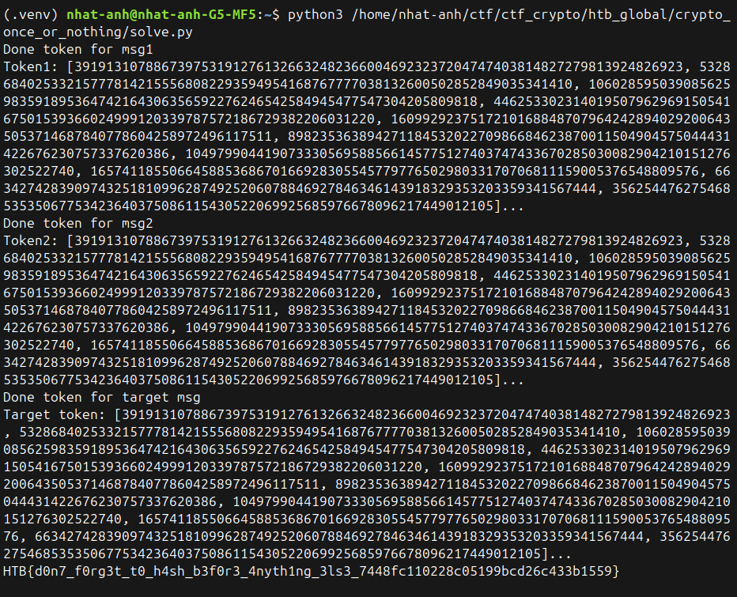

# Once or nothing 

## Category : Crypto 

## 1,Tổng quan 
* Server code triển khai một hệ thống chữ kí số tưởng tự như lược đồ kí Lamport nhưng tái sử dụng cặp khóa 
    * khóa riêng tư và khóa công khai :
        * AuthKey (Khóa bí mật): Chứa một mảng gồm 256 cặp số ngẫu nhiên (s0, s1)
        * AuthPub (Khóa công khai): Chứa 256 cặp giá trị băm tương ứng (hash(s0), hash(s1))

    ```rust
    fn issue_credentials() -> (AuthKey, AuthPub) {
        let key_pairs = std::array::from_fn(|_| {
            (
                U256::from_be_slice(&get_random_bytes(N/8)),
                U256::from_be_slice(&get_random_bytes(N/8))
            )
        });
        let commitments = key_pairs.iter().map(|(s0, s1)| {
                                    (hash_digest(&s0.to_be_bytes()), hash_digest(&s1.to_be_bytes()))
                                })
                                .collect::<Vec<_>>()
                                .try_into()
                                .unwrap();
        (AuthKey { key_pairs }, AuthPub { commitments })
    }
    ```
    
    * Kí/ cấp token cho thông điệp:
        * Pad thông điệp m thành 256 bit 
        * Duyệt qua từng bit:

            * Nếu bit tại vị trí i là 0: Chọn số bí mật s0 tại vị trí đó đưa vào token.

            * Nếu bit tại vị trí i là 1: Chọn số bí mật s1 tại vị trí đó đưa vào token.

    ```rust
    fn issue_token(m: &[u8], auth_key: AuthKey) -> [U256; N] {
        let mut padded = [0u8; N/8];
        padded[(N/8 - m.len().min(N/8))..].copy_from_slice(&m[..m.len().min(N/8)]);
        let message_bits = U256::from_be_bytes((&padded).into());
        let hash_bits = to_bits(message_bits);
        assert!(hash_bits.len() == auth_key.key_pairs.len(), "ERROR: The number of hash bits and the size of the secret key must match.");
        std::array::from_fn(|i| {
            let (zero, one) = auth_key.key_pairs[i];
            if hash_bits[i] { one } else { zero }
        })
    }
    ```
    * Xác thực token :
        * Dựa vào các bit 0 hoặc 1 để nhặt ra các chuỗi băm tương ứng từ khóa công khai AuthPub.
            * Băm các số trong Token do người dùng gửi lên và so sánh với các chuỗi băm vừa nhặt ra. Nếu khớp toàn bộ,token đó là thật.
    ```rust
    fn validate_token(m: &[u8], token: [U256; N], auth_pub: AuthPub) -> bool {
        let mut padded = [0u8; N/8];
        padded[(N/8 - m.len().min(N/8))..].copy_from_slice(&m[..m.len().min(N/8)]);
        let message_bits = U256::from_be_bytes((&padded).into());
        let hash_bits = to_bits(message_bits);
        assert!(hash_bits.len() == auth_pub.commitments.len(), "ERROR: The number of hash bits and the size of the public key must match.");
        let chosen_pk = std::array::from_fn(|i| {
            let (zero, one) = auth_pub.commitments[i];
            if hash_bits[i] { U256::from_be_slice(&one) } else { U256::from_be_slice(&zero) }
        });
        let hashed_token: [U256; N] = token.map(|s| { U256::from_be_bytes(hash_digest(&s.to_be_bytes()).into()) });
        chosen_pk == hashed_token
    }
    ```
* Đảm bảo xử lí thông điệp thành 256 bit trước khi đưa vào hàm kí 
    ```rust
    fn to_bits(n: U256) -> [bool; N] {
    std::array::from_fn(|i| n.bit_vartime((N - 1 - i) as u32))
    }
    ```

* Thử thách chính là tìm được token hợp lên cho thông điệp đích ***"d9_netadmin"*** 
    * Server là 1 Oracle , ta có thể gửi thông điệp bất kì ( trừ thông điệp đích) và nhân đuọc token tương ứng 


## 2,Cách tấn công 

* Lược đồ chữ kí này khá dễ dàng để bẻ gãy chỉ với 2 lần request oracle 
    * Lược đồ chữ kí Lamport tái sử dụng khóa => Lỗ hỏng lớn nhất 
    * Hàm kí và xác thực thực hiện riêng lẻ trên từng bit 
    * Việc hỏi oracle token cho thông điệp bất kì chỉ check xem thông điệp đó có chứa thông điệp đích (target msg) hay không  => chia đôi thông điệp đích để hỏi 
* Quy trình tấn công : 
    * gửi thông điệp 1 :
        ```msg1 = b'd' + b'\xff' * 10``` (11 bytes)
        * Ta lấy được token của padded_msg1 là ```[21 bytes \x00] + b'd' + [10 bytes \xff]```
    * gửi thông điệp 2 :
        ```msg2 = b'9_netadmin'``` (10 bytes)
        * Ta lấy được token của padded_msg1 là ```[22 bytes \x00] + b'9_netadmin'```
    * cắt ghép 176 phần tử đầu của token1 ( tức là phần ```[21 bytes \x00] + b'd'```) và 80 phần tử cuối của token2 ( tức là phần ```b'9_netadmin'```) $=>$  ta đươc valid token của padded_target_msg :
        ```[21 bytes \x00] + b'd9_netadmin'```

    $=>$ gửi server và lấy flag 


## Code khai thác 
```python 
from pwn import *
import re
import binascii

context.log_level = 'error'

def get_token(io, hex_msg):
    io.sendlineafter(b'> ', b'1')
    io.sendlineafter(b'hex: ', hex_msg.encode())
    
    all_data = b''
    while b'Token issued:' not in all_data:
        all_data += io.recvline()
    
    token_line = all_data.decode()
    while ']' not in token_line:
        token_line += io.recvline().decode()
    
    hex_numbers = re.findall(r'Uint\(0x([0-9A-Fa-f]{64})\)', token_line)
    tokens = [int(h, 16) for h in hex_numbers]
            
    return tokens


def main():
    host = '154.57.164.82'
    port = 30548
    io = remote(host, port)
    
    #token of msg1 
    msg1 = b'd' + b'\xff' * 10
    hex_msg1 = binascii.hexlify(msg1).decode()
    token1 = get_token(io, hex_msg1)
    print(f"Done token for msg1")
    print(f"Token1: {token1[:10]}...") 
    
    #token of msg2
    msg2 = b'9_netadmin'
    hex_msg2 = binascii.hexlify(msg2).decode()
    token2 = get_token(io, hex_msg2)
    print(f"Done token for msg2")
    print(f"Token2: {token2[:10]}...")
    
    #combine token1 and token2 to find token of target msg 
    target = b'd9_netadmin'
    final_token = token1[:176] + token2[176:]
    print(f"Done token for target msg")
    print(f"Target token: {final_token[:10]}...")
    
    #send token of target msg and get flag 
    io.sendlineafter(b'> ', b'2')
    io.sendlineafter(b'validate: ', target)
    
    token_hex_str = ','.join(f"{t:064x}" for t in final_token)
    io.sendlineafter(b'hex): ', token_hex_str.encode())
    
    try:
        print(io.recvline(timeout=3).decode())
    except Exception as e:
        print(f"Error: {e}")
    io.close()

if __name__ == '__main__':
    main()
```

## Kết quả chạy code 



* FLAG : **HTB{d0n7_f0rg3t_t0_h4sh_b3f0r3_4nyth1ng_3ls3_7448fc110228c05199bcd26c433b1559}**


